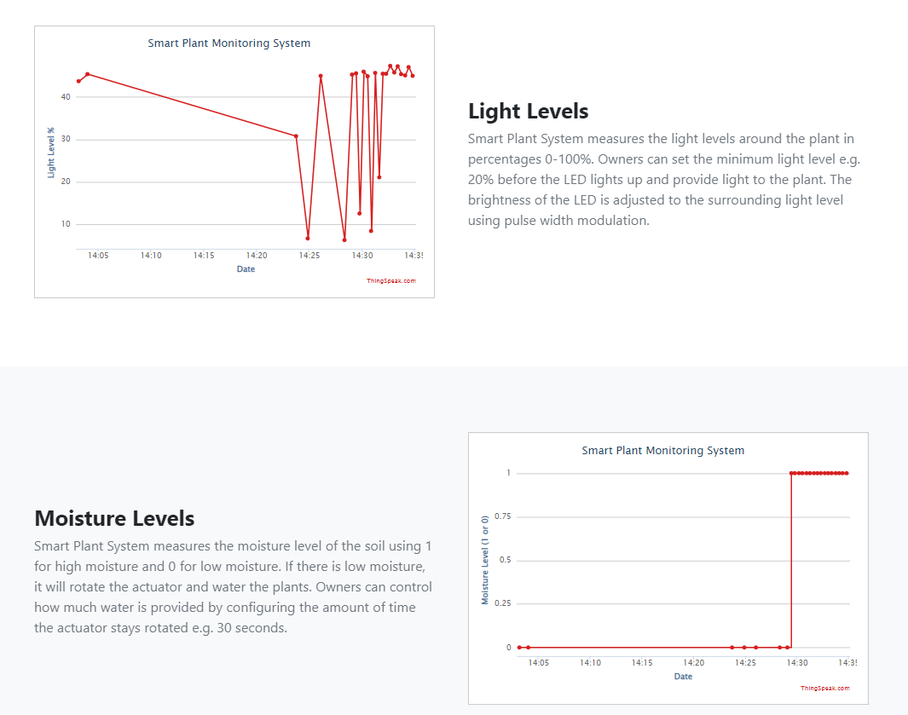

# Smart-Plant-System
Smart Plant System is an IoT plant monitoring system built using Raspberry Pi and Python.
 

# Features
## Monitor Plants in Real-Time
Smart Plant System enables you to view the physical environment of your plant in real-time anywhere.
 

## Configure Settings
Smart Plant System provides flexibility by defining specific parameters that you can customise.
 

## Track Activity
Smart Plant System keeps a log of when light or water is provided to your plant.
 

## Receive Notifications
Smart Plant System automatically alerts owners through Twitter during an event.

# Template
Template used: https://startbootstrap.com/template/heroic-features

# Notes
- Removed API keys
